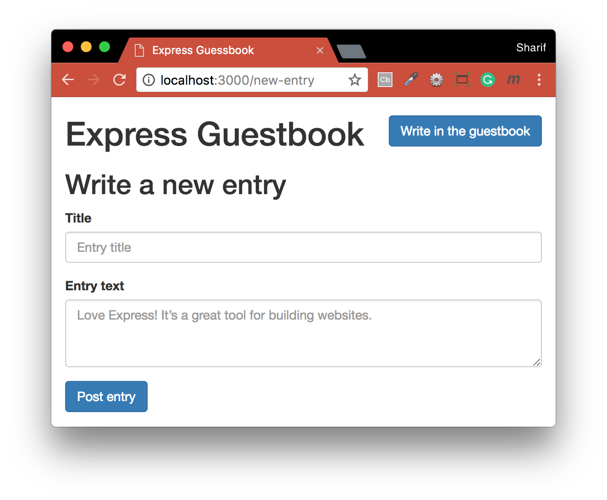

# Guestbook - npm - Express - morgan - EJS
Exercise grab from [Express in Action](https://livebook.manning.com/#!/book/express-in-action/chapter-3/137).
A guestbook is pretty simple: users can write new entries in the online guestbook, and they can browse others’ entries.
Guestbook will have two pages:
- A homepage that lists all of the previously posted guestbook entries
- A page with an “add new entry” form

### Built with
* [npm](https://www.npmjs.com/) - Node Package Manager
* [Express](https://expressjs.com/) - Server-side JavaScript Framework
* [morgan](https://www.npmjs.com/package/morgan) - HTTP request logger middleware for node.js
* [EJS](https://www.npmjs.com/package/ejs) - Embedded JavaScript templates

### Learning Objectives
- You use a middleware function to log all requests, which helps you do debugging. You also use a middleware at the end to serve the 404 page.
- You use Express’s routing to direct users to the homepage, the “add a new entry” view, and the POST for adding a new entry.
- You use Express and EJS to render pages. EJS lets you dynamically create HTML; you use this to dynamically display the content.

